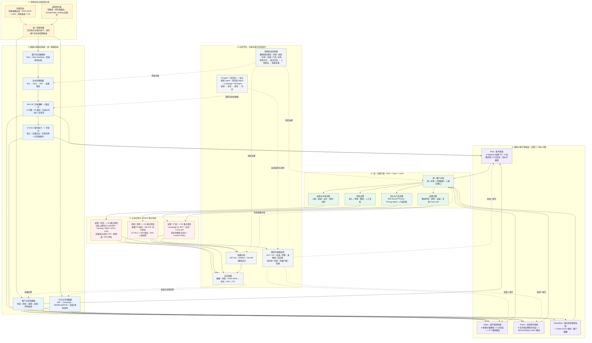

# 澳洲模型体系建设 MBR 汇报底稿

## 开场｜汇报主线

**核心观点**：澳洲业务模型建设正从「单一风险判断」升级为「风险 × 价值 × 意愿」的组合决策；当前重点是把已验证的单点模型接入统一数据链路和业务流程，形成可调用、可评估、可迭代的经营闭环。

**主线四段**：

1. **为什么现在**：获客贵、转化长、监管严——澳洲经营的三个结构性约束，决定了决策必须从经验走向量化分层；
2. **判断什么**：从「能不能借」（风险）扩展到「值不值得经营」（价值）和「当前想不想借」（意愿），逐步形成联合分层，指导人群、定价、额度与投放；
3. **靠什么支撑**：自研银行流水体系（BS-CAT）——逐步降低对 illion 分类结果的依赖，提升分类粒度、问题定位能力与迭代效率；
4. **走向哪里**：数据 → 能力 → 模型 → 决策 → 业务应用的完整闭环，投放、运营、风控、定价共用一套分层标准。

**读图方式**：自上而下是“目标 → 数据 → 模型 → 决策 → 应用 → 评估”的主链路；虚线是“业务结果、实验、监控和知识”向前回流的迭代闭环。状态标记统一为：● 已上线 / 已完成验证，◐ 建设或集成中，○ 规划。

---

## Part 1 澳洲模型规划

### P1｜为什么要建设澳洲模型体系

**核心观点**：获客成本高、转化链路长、合规要求严，使“同一人群、同一策略”的粗放经营难以持续；分层决策是同时改善规模、风险与投入产出比的关键抓手。

**关键信息**：

- **获客贵**：现有召回案例中，触达 13.6k 用户仅带来约 30 个 Leads，说明仅靠“圈人—触达”难以回答“谁值得买、花多少钱买”；【建议补充：同期渠道基准、成本及转化口径，避免单一案例被过度外推】
- **转化长**：信贷转化链路长（曝光 → 下载 → 注册 → 申请 → 授信 → 放款），iOS 归因不完整，投放效果长期无法稳定回答「这笔 Loan 是哪次投放带来的」；
- **监管严**：澳洲 Responsible Lending 规则要求信贷机构合理询问客户需求、目标和财务状况，采取合理步骤核实财务状况，并评估合同是否“不适合（unsuitable）”；对 SACC 还需取得并考虑收入账户至少此前 90 天的逐笔交易与余额信息；
- **经营目标**：支撑 2026H2 放款规模目标，以及公司 O2-KR1“NON SAAC 占比全年不低于 40%、风险表现 7.1%”。【待确认：7.1% 对应的风险指标、账龄和观察窗】

**建议展示**：三约束卡片 + OKR 目标条，一页立题。

### P2｜当前处于什么阶段

**核心观点**：澳洲模型建设已完成多项单点能力验证，当前进入“体系化落地”阶段；模型效果已有证据，但统一调用、数据回传和增量评估尚未全部闭环。

**关键信息**：

- **已完成或已验证**：新客价值模型 1.0（OOT AUC 0.729）、老客风险模型 V2（OOT AUC 0.709，较 V1.1 提升 2.84%）、复贷响应模型（AUC 0.703）；WageGo 新客审批风险主模型 2026-06 版本已生产运行；BS-CAT 已完成 preview 部署并开放接口；
- **8 月里程碑**：负债类、收入类知识库初始化完成，Liability 效果报告发布；
- **当前推进中**：消费类知识库建设、新 S-CALC 开发、新 IDA 调用链路开发、两个运维 Agent 开发；
- **9 月目标**：完成 BS-CAT 正式版发布、分类数据落库、IDP/IDA 链路调通和新旧链路并行验证；达到预先约定的质量与稳定性门槛后，再进入切量决策。

**建议展示**：时间线图（8/9 → 8/11 → 8/21 → 8/31 → 9/15 → 切量）。

### P3｜已完成什么：模型版图覆盖客户全生命周期

**核心观点**：已形成覆盖「新客 → 复贷 → 老客」的模型能力版图；核心经营模型已有跨时间或独立样本验证，下一步是统一分层口径并接入业务流程。

**关键信息**：

| 环节     | 模型                                  | 效果（OOT）                                                             | 状态                                                  |
| -------- | ------------------------------------- | ----------------------------------------------------------------------- | ----------------------------------------------------- |
| 新客审批 | WageGo 新客风险主模型                 | 生产运行（2026-06-26 版本）                                             | 已上线，H2 持续迭代区分度                             |
| 新客经营 | 新客价值模型 1.0（LightGBM，17 特征） | AUC 0.729 / KS 0.347；模型高分 Top10% 的弱价值率 63.00%，低分端为 7.30% | 已完成离线评估；授信 / 定价 / 审批 / 分层为拟落地场景 |
| 复贷经营 | 复贷响应模型（结清后 7 天再申请意愿） | AUC 0.703 / KS 0.298，Top10% 复申率 88% vs 底部 31%                     | 已验证，风险中性（不影响信用风险）                    |
| 老客审批 | 老客风险模型 V2（双塔融合）           | AUC 0.709 / KS 0.311，较 V1.1 提升 2.84%                                | 待监管确认后替换 V1.1【待确认】                       |
| 底层数据 | 银行流水分类模型 BS-CAT（9 引擎）     | 35 个 case 的 OOT 中，对 illion 已识别覆盖 98.5%，净增识别 317 条       | preview 已部署；8/31 正式版为计划节点                 |

**建议展示**：客户生命周期横轴（新客 → 复贷 → 老客）+ 模型卡片矩阵，每个模型带一个关键数字。

### P4｜模型之间是什么关系：三维分层一体化体系

**核心观点**：目标态是以风险、价值、意愿三类评分形成统一分层，分别回答“能不能借、值不值得经营、当前想不想借”，共同支撑投放、运营、定价与额度决策。

**关键信息**：

- **三层结构**：数据层（银行流水 + 平台行为 + 征信/替代数据）→ 模型层（风险 / 价值 / 意愿三类模型）→ 决策层（人群分层、额度、定价、审批、投放出价）；
- **统一分层标准（建设中）**：低风险 × 高意愿 × 高价值 = 核心经营人群；高风险 × 高意愿 = 风险控制人群；低风险 × 低意愿 × 高价值 = 激活人群；中风险 × 高意愿 × 高价值 = 定价与产品匹配人群；
- **定价联动**：Risk Band × Value Band × Intent Band → 定价建议矩阵（Pricing Matrix，数据驱动的价格敏感性分析）；
- **老客三级标尺**：Risk Score（风险高不高）→ LTV（长期价值高不高）→ Fundo Score（当前是否值得运营），逐级补充排序能力。

**建议展示**：三层金字塔图 + 三维分层示例表。

### P5｜当前正在推进什么：2026H2 重点项目

**核心观点**：H2 聚焦“银行流水切量准备、三维分层落地、AI 运维试点”三条主线；优先解决找谁、出价多少、客户质量如何、效果如何回传四个问题。

**关键信息**：

- **投放侧（六大方向）**：Risk × Intent × Value 分层标准与投放人群包（P0）、Tracking 归因与回传策略体系（P0）、LTV 测算与买量线 / 边际 CPS 监控（P0）、新客 PD 模型迭代（P0）、A/B 实验规范与增量测试（P0/P1）、新渠道评估与 APP 转化分析（P1）；
- **运营侧（四大方向）**：客户 LTV 模型与三维分层体系（P0）、Risk-Based Pricing 价格敏感性分析（P0）、多触点归因与触达策略基建（P0）、Campaign / AB Test / Email 监控 Agent（P0）；
- **银行流水侧**：推进正式版发布、分类数据落库、新旧 IDP 链路并行验证、S-CALC 与 LMS 改造（计划节点 8/31—9/15）；
- **AI 运维侧**：质检 Agent + 知识库 Agent 试点（OKR O4-KR1），对比 AI 与人工在覆盖率、问题发现时效和人力投入上的差异；
- **跨团队机制**：以模型团队为核心枢纽，与投放、运营团队建立「需求对齐—联合开发—上线验证—效果复盘」闭环（OKR O5-KR2）。

**建议展示**：项目优先级矩阵（P0/P1 × 方向），或三条主线并行的里程碑图。

### P6｜对业务、风险和运营分别带来什么价值

**核心观点**：模型体系把「经验决策」变为「量化决策」，直接支撑投放效率、风险表现与老客经营三大经营目标。

**关键信息**：

- **对风险**：老客风险模型 V2 在同等通过率下坏账更少、或同等坏账下通过更多（swap-in/out 验证方向正确）；风险 × 价值矩阵中「风险1-2 × 价值1-2」客群逾期率仅 6.30%，是值得放量的优质盘；支撑风险表现 7.1% 目标；
- **对投放**：从「买量」升级为「买优质人群」——分层人群包直接供媒体定向调用、回传策略引导媒体算法找「风险可接受、价值可覆盖成本」的人、净 LTV 与边际 CPS 让预算与扩量决策有量化依据；支撑 NON SAAC 占比 ≥ 40%；
- **对运营**：LTV 评价体系统一衡量额度、期限、定价、权益投入；复贷响应模型在结清时点精准识别「立即回来」的客户（Top10% 复申率 88%）；Fundo Score 支撑 Campaign 排序与高潜识别；
- **对组织效率**：计划以“1 人 + 2 个 AI Agent”试点银行流水运维闭环，用 AI 辅助监控、诊断和知识更新；实际节省工时与问题发现时效需在试点后量化。

**建议展示**：三列价值对照表（风险 / 投放 / 运营 × 模型支撑 × 量化指标）。

### P7｜后续规划：从「有模型」到「模型驱动经营」

**核心观点**：H2 完成体系落地后，下一步用实验体系量化模型增量价值，并向 LTV、额度 uplift、RTA 前置风控等方向延伸，最终形成「数据 → 模型 → 决策 → 评估 → 迭代」的经营闭环。

**关键信息**：

- **2026H2 OKR 主线**（O2 业务价值实现，权重 30%）：新客质量分层与投放优化（O2-KR1）、老客意愿能力建设与 Web→APP 增量转化（O2-KR2）、银行流水在核心决策场景落地（O2-KR3）；
- **2026H2 基建主线**（O3，权重 20%）：银行流水分类模型稳定生产运行 + 知识库质量迭代闭环（每月至少 1 次效果监控复盘）；
- **实验体系**：增量额度试点（3–6 个月回答「额度与价值」因果）、投放 Geo-lift / Holdout 增量测试、AB 实验显著性规范；
- **远期方向**：额度 uplift 模型、RTA 实时前置风控评估、Open Banking 等多数据源接入、跨市场能力复用（APP List / 短信 / 变量挖掘平台的经验向澳洲复制）。

**管理层决策点**：确认三项优先级——BS-CAT 切量门槛、价值模型首批场景、增量额度试点风险预算；其余能力建设按上述三项的落地效果排序。

**建议展示**：OKR 目标 → 关键动作 → 里程碑 对照表 + 远期路线图。

---

## Part 2 价值模型介绍

### P1｜管理层最关心的问题：模型识别的是客户价值，还是历史额度策略

**核心观点**：历史额度确实会影响利息收入，因此必须控制额度后再验证模型；同额度分层结果显示，模型仍能区分客户表现，说明其捕捉的不只是历史额度策略。

**关键信息**：

- **问题实质**：客户价值高，是因为我们给了更高额度导致利息收入更多；还是客户本身价值高，所以应该给更高额度？模型到底是在发现价值，还是在复述历史策略？
- **直接回答**：时间顺序上额度在先、利息收入在后，二者存在机械关联；但同样额度能否转化为收入并控制风险，仍取决于客户自身的收入、现金流和履约能力。价值模型的作用，是在额度决策前识别这部分客户差异；
- **决定性检验——同额度分层**：把客户按额度区间分组，在每个额度区间内部比较价值分箱的表现。若「同样拿到这个额度的客户，模型仍能识别谁赚谁亏」，即证明价值信号在额度之外；
- **验证结果**：6 个申请金额区间内平均收入全部单调（5000+ 段：价值1 收入 10,388 vs 价值5 收入 3,891）；4 个总额度区间内逾期率全部随价值变差单调上升（如 500–1000 段：价值1 逾期 4.37% vs 价值5 逾期 20.59%）。

**建议展示**：同额度分层双图（收入图：高价值线整体在上方；逾期率图：高价值线整体在下方）。标题直接写结论：“控制额度后，模型仍有稳定区分度”。

### P2｜价值模型是什么：定位与思路

**核心观点**：价值模型预测客户未来 3 个月的利息收入贡献，回答「谁值得经营」；额度策略回答「给多少额度释放价值」——二者是识别与分配两个阶段的工作。

**关键信息**：

- **模型定义**：新客价值模型 1.0（与创新申请材料中的 New Customer Qualification Model 1.0 为同一模型），采用 LightGBM 二分类、17 个银行流水特征，建模样本 56,330（2024-04 起）；目标变量为“3 个月利息收入低于 160”的弱价值标记，目标样本占比 27.12%；
- **分数方向**：模型原始分越高，代表弱价值概率越高；对外经营档位按“价值 1 → 价值 5”展示，其中价值 1 最好、价值 5 最弱。PPT 中必须统一这一方向，避免把“高模型分”误读为“高价值”；
- **建模思路**：利息收入目标天然内嵌风险收益权衡——早逾期的客户贡献零利息，自然落入低价值；模型用收入能力、现金流、负债与支出结构四类特征做预测，Top 特征为工资收入 182 天汇总（重要度 20.25%）、近 56 天收入均值（15.60%）、近 168 天借方均值（15.23%）；
- **流程定位**：客户真实价值潜力 → 价值模型识别（识别问题：谁值得经营）→ 额度策略调整（分配问题：给多少）→ 价值释放（利息收入、复贷、长期贡献）；
- **能力边界**：模型是预测性模型，回答「当前策略下谁更可能贡献价值」，不回答「加 1000 额度价值增加多少」（后者属于因果推断，留给试点实验）。

**建议展示**：模型定位四步流程图 + 模型信息卡（算法 / 特征数 / 样本 / 目标定义）。

### P3｜做得怎么样：跨时间保持区分度，控制额度后仍然有效

**核心观点**：模型在跨时间样本上保持区分度，且控制额度后仍能稳定排序，具备开展业务试点的基础；是否产生增量收益仍需通过实验验证。

**关键信息**：

- **整体效果**：OOT AUC 0.7294 / KS 0.3467（INS 为 0.7015 / 0.2939）；按弱价值概率排序，高分 Top10% 的弱价值率为 63.00%，低分 Bottom10% 为 7.30%，高分 Top10% 捕获 24.54% 的弱价值样本，Lift 2.45；
- **分箱单调**（申请样本 151,579，价值 1→5）：平均收入 9,611 → 3,924；通过率 41.04% → 6.57%；3M30 逾期率 7.05% → 22.90%，逐档单调、无倒挂；
- **同额度分层验证**（控制额度变量后）：收入 6 个区间全单调；可支配盈余 1,334 → 84（首尾 16 倍，成交样本 2,032 → 1,232 完全单调）；平均支出 7,902 → 3,566 完全单调；逾期率 4 个有效区间全部单调上升——价值信息确实存在于额度之外；
- **局限与使用边界**：总额度 2,500+ 区间暂无足够放款表现样本，不能据此判断高额度策略效果；OOT 概率校准偏差约 2.15 个百分点，当前更适合用于排序分层，如用于概率阈值或定价需先完成校准。

**建议展示**：效果指标卡（AUC / KS / Top10%）+ 分箱趋势图 + 同额度分层验证图。

### P4｜模型识别的是什么：人群画像

**核心观点**：价值模型识别的是「收入体量 + 现金流连续性 + 职业渠道稳定性」构成的综合经营质量，而不是单纯的负债高低。

**关键信息**：

- **价值好人群**（价值 1/2 档 vs 4/5 档）：工资收入总额 41,139 vs 11,130；工资入账次数 20.5 vs 10.6；Centrelink 收入占比 2.1% vs 14.6%；couple 家庭占比 43.8% vs 29.1%；行业信息缺失率 3.5% vs 30.7%；
- **价值弱人群**（价值 4/5 档）：收入与工资频次更低、发薪周期更不稳定、福利收入依赖更高、行业识别缺失更多，核心特征是“稳定且可识别的职业现金流较弱”；【待确认：原材料中“发薪周期波动 2.72 vs 3.79”的指标名称、方向和单位，确认前不建议上屏】
- **重要发现**：数据不支持「价值差 = 负债更重」——价值差人群的信贷还款金额、还款次数反而更低，反映的是整体资金体量与信贷活动规模小，而非多头高负债；
- **风险错配画像**：价值好但风险差 = 高收入 + 高支出 + 高赌博占比 + 余额波动大（收入端强、行为端弱）；价值差但风险好 = 低收入但支出克制、赌博低、账户稳定（可单独观察其真实表现，不宜一刀切）。

**建议展示**：好/差人群特征对比表（含支撑数字），一张表讲清「模型在看什么」。

### P5｜怎么用：风险 × 价值联合决策

**核心观点**：价值模型与风险模型解决不同问题，应联合使用；价值扩张以风险预算为上限，目标是在风险约束下优化组合收益，而不是单纯提高额度。

**关键信息**：

- **高价值 × 低风险**（风险1-2 × 价值1-2）：样本占比 12%，3M30 逾期率 6.30%——优先经营客群，提升额度扩大价值捕获，承接 3000–5000 优质 MACC / LACC 候选池，后续筛选为循环贷扩展候选；
- **高价值 × 高风险**（风险4-5 × 价值1-2）：3M30 逾期率 12.90%——有价值但风险高，不直接放大额度，通过 EWA / 超短期、小额、即时周转产品承接并控制风险暴露；
- **低价值 × 低风险**（风险1-2 × 价值4-5）：低风险但价值弱，通过低额度 Personal Loan 验证稳定需求、复贷表现与真实贡献；
- **低价值 × 高风险**（风险4-5 × 价值4-5）：样本占比 48.85%，逾期率 22.25%——优先风险控制客群，限额、提价、人工审核、谨慎准入；
- **应用原则**：额度总量受风险预算约束时，经营问题本质是“有限额度如何分配”。离线 Lift 证明模型具备排序能力；“差异化额度优于一刀切”仍需随机试验或准实验验证增量收益。

**建议展示**：2×2 四象限矩阵图，每格带「数据 + 策略 + 对应产品」。

### P6｜下一步：试点与迭代方向

**核心观点**：价值模型的最后一步是用实验量化增量价值，并沿「全生命周期价值」方向持续深化。

**关键信息**：

- **增量额度试点（建议启动）**：在风险可接受的中价值客户中随机分组，实验组提高额度、对照组维持现状，观察 3–6 个月的提款、收入、逾期和风险调整后收益；试验前需锁定主指标、护栏指标、样本量、额度上限和停止规则【待确认：是否已启动】；
- **标签口径加固（可选）**：价值口径从「绝对利息收入」转向收益率（利息 / 在贷余额）或风险调整后贡献（利息 − 资金成本 − 风险成本），从源头消除与额度的机械耦合；
- **LTV 扩展**：从 3 个月利息收入扩展到全生命周期价值（LTV = 收入贡献 − 风险损失 − 资金成本 − 获客/运营成本），支撑额度、期限、定价、权益与 Cross-sell 投入评估（运营合作 P0 项目）；
- **落地场景推进**：授信、定价、审批、客群分层、投放人群包、老客权益分配【待确认：当前各场景落地进度】。

**管理层决策点**：建议首批只选 1–2 个可闭环评估的场景，优先“风险 × 价值分层授信”和“投放人群包”；确认实验风险预算后再扩展到定价、权益与 LTV。

**建议展示**：试点设计示意图 + 迭代路线（价值模型 → LTV 模型 → 额度 uplift 模型）。

---

## Part 3 银行流水架构介绍

### P1｜银行流水为什么重要：信贷决策的底层依据

**核心观点**：在澳洲 Responsible Lending 框架下，Serviceability（偿付能力）是内部信审的重要控制；流水识别会直接影响收入、支出和负债的计算，进而影响“不适合性”评估与授信质量。

**关键信息**：

- **核心计算逻辑**：Serviceability ＝ 收入 − 必要支出 − 负债还款 ＝ 客户可支配盈余；
- **监管要求**（National Consumer Credit Protection Act 2009 / ASIC）：合理询问客户的需求与目标、合理询问并核实其财务状况、评估合同是否“不适合”；若客户可能无法履约或只能在承受重大困难的情况下履约，或合同不满足其需求与目标，则属于不适合；对 SACC，核实财务状况时还需取得并考虑收入账户至少此前 90 天的逐笔交易与余额信息；
- **模型侧证据**：新客价值模型最重要的 Top 特征全部来自银行流水（工资收入、收入均值、借方均值）；老客风险模型 V2 中银行流水子模型贡献 68.25% 融合权重——流水数据质量直接决定模型上限；
- **业务链路位置**：用户申请 → 银行卡绑定 → 数据解析 → 银行流水识别 → Serviceability → 信审决策。

**建议展示**：信贷决策链路图，突出流水识别环节；辅以「流水识别 → 三个计算 → 决策」的传导示意。

### P2｜原有方案的四大局限：为什么需要建设自主分类能力

**核心观点**：高度依赖 illion 分类结果，会在问题定位、细分类别、口径调整和新数据源接入上形成瓶颈；自主分类能力的价值在于可解释、可配置和可持续迭代。

**关键信息**：

- **逻辑不透明，问题难定位**：黑盒模型，出现漏识别或误分类时，无法判断是交易描述、商户映射、分类规则还是计算逻辑的问题；
- **粒度与覆盖不足**：无法拆分 SACC、Non-SACC、BNPL、Line of Credit、Wage Advance 等贷款类型；小型商户、新兴平台、交易别名易被归入 Other 或错误分类，直接影响贷款归属、还款匹配及收入、支出、负债计算；
- **口径无控制权**：下游 IDP 所需字段可能缺失，公式、数据窗口、异常处理无法按内部标准配置；Open Banking 等新数据源无分类字段，多供应商需维护多套适配逻辑；
- **合规应对受制于人**：调整依赖供应商排期、响应周期长；分类作为基础能力长期外置，会限制模型与策略的自主迭代。

**建议展示**：四大局限图标列表，每项配一个业务影响示例。

### P3｜目标架构：从原始流水到信审决策的完整链路

**核心观点**：目标链路为「IDA 发起 → IDP 调度 → BS-CAT 分类 → S-CALC 计算 → 风险模型决策 → LMS 输出」。截至 8 月 27 日，BS-CAT preview 与接口已具备，端到端集成、落库、S-CALC 和 LMS 改造仍在推进。

**关键信息**：

- **九步目标链路**：IDA 发起贷款申请与流水处理请求 → AWS SQS 消息队列 → IDP 拉取申请、预处理数据并编排流程 → 调用 BS-CAT → 输出逐笔分类、交易对手与收入/负债流摘要 → S-CALC 计算收入、负债、支出和可支配盈余 → 结果落库 → 风险模型结合客户画像与历史表现输出评分/建议 → LMS 展示推荐额度、质量标签和可解释结果；
- **架构取舍**：让分类模型输出「可直接用于信审」的核心结果，IDA 只保留必要的调度、汇总与基础计算，降低下游复杂度；
- **BS-CAT 内核**（ServiFlow-AI，代码核对日期 2026-08-27）：9 个分类引擎 + 1 个编排器，规则外置在各引擎 CSV 中，推理不加载任何模型权重（CPU 即可运行）；35 个活跃类别；商户知识库约 3 万关键词变体 / 9 千商户；输出交易分类、交易对手、收入流汇总（estimatedMonthlyIncome / predictedNextIncomeDate）、负债流汇总（fundedAmount / repaidAmount / predictedClosingDate）、分类汇总；
- **贯穿链路的支撑**：分类知识库（规则、关键词、第三方数据）+ 分类能力监控与运营（效果监控、异常跟踪、人工复核）。GenAI 可作为后续辅助分析能力，不进入当前生产主链路，避免架构图把规划能力表述为已上线能力。

**建议展示**：端到端流程图（保留可编辑 mermaid，勿用静态图片）。

### P4｜各模块之间的关系与分工

**核心观点**：模块边界应按“发起—调度—分类—计算—决策—展示”拆分，并为每个接口明确输入、输出、负责人和异常兜底机制。

**关键信息**：

- **IDA（申请发起方系统）**：发起贷款申请与流水处理请求，并承接上层流程调用；IDA/IDP 对接负责人为 Tien / Niral【待确认：Serviceability 计算最终归属 IDA 还是 S-CALC，当前两处表述存在重叠】；
- **IDP（Illion Data Processing）**：拉取申请、预处理数据、编排流程（对应 fl-illion-dataprocessing-api，处理 illion 原始数据为结构化表）；
- **BS-CAT（银行流水分类模型）**：核心自主能力，逐笔交易理解 + 收入/负债流构建 + 跨引擎分类汇总；
- **S-CALC（服务能力计算）**：基于分类结果执行收入/负债/支出与可支配盈余计算（新 S-CALC 开发中，9/15 前完成）；
- **LMS（贷款管理系统）**：输出推荐额度、质量标签、可视化结果；新页面改造 9/15 前完成，AB 前交付人审使用；
- **人审（SAV）**：Case 复核、异常解释、质检样本与业务反馈闭环。

**建议展示**：模块职责表 + 三方分工表（IDA / 风险模型 / 人审）。

### P5｜数据链路：从一笔交易到客户财务画像

**核心观点**：系统将“时间、金额、方向、交易描述”加工为交易对手、交易类别和收入/负债流，再汇总为客户级财务画像，为偿付能力计算提供结构化输入。

**关键信息**：

- **交易明细维度**（三级加工）：原始描述 → 标准交易对手 → 分类与依据。示例：`BILL PAY Fair Go Finance ...` → Fair Go Finance → SACC Loans；`PAYROLL ACME PTY LTD` → ACME PTY LTD → Wages；`MCDONALDS BRISBANE` → McDonald's → 消费类；
- **单笔贷款画像（展示示例，非效果样本）**：借款 A$1,500、已还本金 A$936、预计剩余 4 期、月还款约 A$338、产品类型 SACC、状态在贷；
- **用户整体负债画像（展示示例，非效果样本）**：负债机构 2 家、在贷 3 笔、负债结构 SACC 65% / Non-SACC 15% / BNPL 20%、90 天借款 A$2,300、月还款/月收入 5.8%；
- **贷款状态判断**：在贷 / 结清 / 违约中 / 状态不明，支撑「当前负债压力」与「还款中断」识别。

**建议展示**：三级加工示意——原始流水表 → 逐笔分类表 → 负债画像卡片。

### P6｜效果验证：负债分类已具备进入并行验证的基础

**核心观点**：35 个申请 case、44,241 条交易的 OOT 实测（2026/07/20–21）显示，自研负债分类在覆盖率和若干典型细分类别上优于 illion，已具备进入生产并行验证的基础；样本规模不足以支持“全面替代”的结论。

**关键信息**：

- **覆盖率**：我方识别贷款 5,680 条（覆盖率 12.8%）vs illion 5,363 条（12.1%）；对 illion 已识别结果覆盖 98.5%（5,284/5,363）；净增识别 317 条（我方独有 396 − illion 独有 79）；独有识别集中在 BNPL、EWA、Home Loan；
- **一致性**：双方共认分类一致率 92.0%。典型案例：同一 MoneySpot 贷款流 11 笔交易，illion 前 6 笔标 SACC、后 5 笔标 Non-SACC，标签自相矛盾；我方基于完整贷款流统一判定为 SACC；
- **典型案例**：Credit24 的 19 笔交易被 illion 归为 SACC Loans，我方结合交易模式与机构产品知识识别为 LOC、归入 Non-SACC；该案例说明自研规则在细分类别上具有优势，但不能替代总体准确率评估；
- **覆盖盲区**：illion 将 Home Loan 还款归为 Internal Transfer（住房贷款完全遗漏），我方通过产品词库识别——覆盖 illion 的盲区。

**建议展示**：韦恩图（5,680 / 5,363 / 交集 5,284）+ 三个典型案例对比表。

### P7｜质量保障与演进方向

**核心观点**：通过“引擎校验 + 四层基线回归 + 人工复核 / Agent 辅助”控制变更质量；9 月目标是完成并行验证和切量准备，是否替换 illion 由预设门槛和业务验证结果决定。

**关键信息**：

- **质量保障机制**：每台引擎输出过 6 项校验（类型、列完整、键唯一、越权检查、类别归属等）；每次变更过四层基线回归（最终分类结果 / 引擎认领层 / 配置版本指纹 / 汇总指标层），任何规则调整可追溯、可回滚；
- **运维闭环（试点目标：1 人 + 2 Agent）**：质检 Agent 监控分类漂移、命中下降和交易对手异常；知识库 Agent 检索未知商户、交叉验证冲突知识并生成更新建议；所有规则变更经人工确认和基线回归后发布，形成“监控 → 定位 → 修复 → 沉淀”闭环；
- **上线里程碑（截至 8/27）**：8/11 负债类知识库初始化、Liability 效果报告、preview 部署和接口开放已完成；8/21 全类别知识库、两个运维 Agent、全分类效果报告的交付状态【待确认】；8/31 计划完成正式版、落库及 IDP/IDA 链路；9/15 计划完成新 S-CALC、LMS 页面、人审知识同步和新旧链路并行测试；
- **建议切量门槛**：除分类一致率外，同时设置关键类别准确率 / 召回率、Serviceability 差异、接口成功率与时延、人工复核通过率、异常回退能力；门槛连续达标后再确定切量比例和日期【具体阈值待风险、业务、模型三方确认】；
- **演进方向**：Open Banking 等多数据源接入（自研分类天然适配无分类字段的新数据源）、GenAI 辅助复杂规则与补充判断、知识库随官方商户注册数据与线上未识别交易双流水线持续更新、后续支持更多风险与运营场景落地。

**管理层决策点**：确认并行验证门槛和切量责任人；在门槛达标前，保留 illion 结果作为对照与回退路径，不以单次 OOT 结果直接做全量替换决策。

**建议展示**：上线时间线 + 运维闭环环形图（监控 → 定位 → 修复 → 沉淀）。

---
