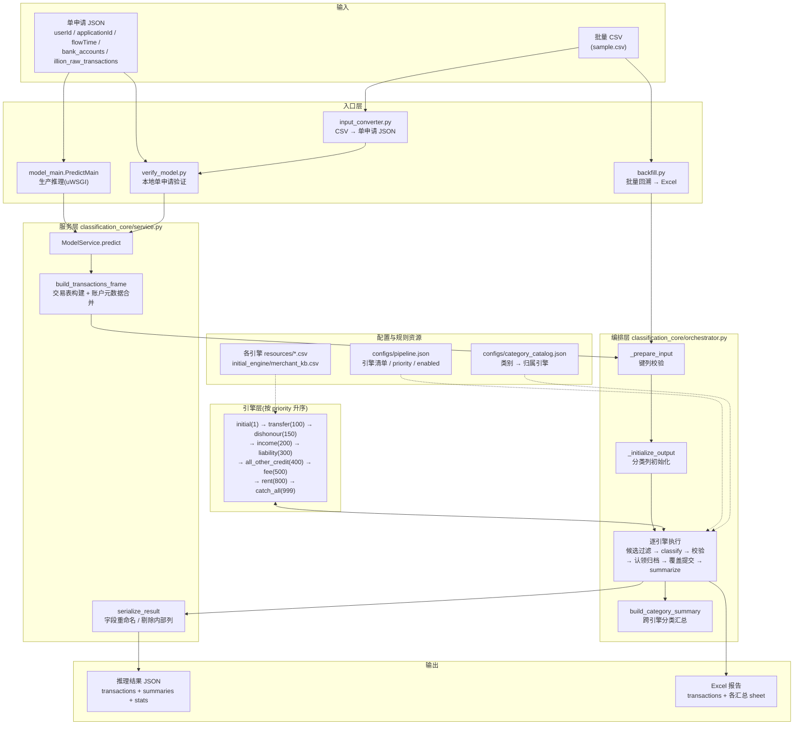
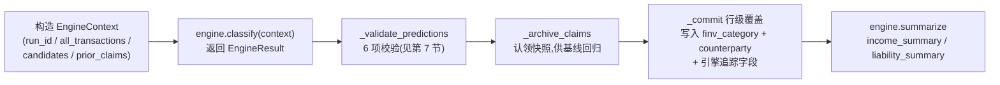

# ServiFlow-AI 模型架构说明

> 本文档描述 ServiFlow-AI 的完整架构与从输入到输出的全流程,内容基于代码核对(核对日期:2026-08-27)。如代码更新导致本文档过时,以代码与 [README.md](README.md)、[CLAUDE.md](CLAUDE.md) 为准。

## 1. 模型是什么

ServiFlow-AI 是一个面向澳洲市场的**银行流水交易分类服务**:对单个贷款申请(application)的 Illion 原始交易流水逐笔打上分类标签,并输出收入流、负债流、分类汇总等业务摘要,供下游风控决策使用。

几个关键特征:

- **规则流水线,而非权重模型**:模型由 9 个分类引擎 + 1 个编排器组成,引擎规则外置在各引擎 `resources/` 目录的 CSV 中,**推理时不加载任何模型权重**,只需加载流水线配置与规则资源。
- **单申请为最小执行单元**:一次推理处理一个 application 的全部交易。
- **运行环境**:CPU、Python 3.11、依赖仅 numpy / pandas / openpyxl / pyahocorasick。
- **部署形态**:Python 服务,由 uWSGI 托管,推理对象为 `model_main.PredictMain`。

## 2. 总体架构

系统分七层:输入 → 入口层 → 服务层 → 编排层 → 引擎层(9 引擎)→ 输出层,配置与规则资源贯穿其中,另有基线回归作为变更校验层。



注:`backfill.py` 直接读 CSV 进入编排层,不经过 `build_transactions_frame`(因此账户元数据列需由 CSV 自带);`verify_model.py` 与 `model_main.py` 都经过服务层的完整路径。三者共用同一个编排层与引擎层,**分类逻辑完全一致**,仅输入输出格式不同。

## 3. 输入格式

| 字段 | 类型 | 说明 |
| --- | --- | --- |
| userId | int | 用户 ID |
| applicationId | int | 申请 ID,会回填到交易行级输出 |
| flowTime | string | 请求时间,原样回显 |
| bank_accounts | array | 账户元数据(account_type / bank / credit_limit),**不参与分类**,仅输出到顶层 bankAccounts |
| illion_raw_transactions | array | Illion 原始交易,每行至少含 transaction_id、transaction_date、amount、dr_cr、text;行内缺 application_id 时由顶层回填;**空数组合法**(返回空成功结果) |

上游额外传入的字段(如 `illion_day_end_balances`)会被忽略,不影响推理。完整输入示例见 [README.md](README.md)。

## 4. 从输入到输出的完整流程

### 第 1 步:入口接收输入

- 生产推理:`model_main.PredictMain.__init__` 在服务启动时完成加载(`ModelService` 构造,即加载流水线配置 + 类别目录),`predict(input_dict)` 接收单申请 JSON dict。
- 本地验证:`verify_model.py` 读取单申请 JSON 文件(默认 `model_input.json`)。
- 批量回溯:`backfill.py` 读取 CSV(默认 `sample.csv`,可含多个 application)。
- 样本转换:`input_converter.py` 从 `sample.csv` 交互式提取指定 application,生成 verify 用的 JSON 入参。

### 第 2 步:构建交易表(`build_transactions_frame`)

将 `illion_raw_transactions` 转为 pandas DataFrame,并:

- 校验 `illion_raw_transactions` 必须是 list(否则返回 `status=failed`,见第 9 节);
- 行内缺 `application_id` 时用顶层 `applicationId` 回填;
- 将 `bank_accounts` 中的 `account_type` / `bank` / `credit_limit` 按 `bank_account_id` 左连接合并到交易表(仅 JSON 入口;backfill 的 CSV 需自带这些列)。

### 第 3 步:输入校验(`_prepare_input`)

- 键列 `application_id`、`transaction_id` 必须存在;
- 键值不得为空;
- `(application_id, transaction_id)` 对必须唯一。

### 第 4 步:输出层初始化(`_initialize_output`)

在原始交易表上追加分类结果列,全部置空:

- 业务结果列:`counterparty`、`finv_category`、`stream_id`;
- 引擎追踪列:`classification_status`(初始 `unclassified`)、`classification_engine`、`classification_engine_version`、`classification_priority`、`classification_rule_id`、`classification_reason`(追踪列在最终序列化时被剔除,不对外输出)。

**特例**:输入为空交易时直接短路,返回结构正确的空成功结果(不执行任何引擎)。

### 第 5 步:逐引擎执行(核心循环)

编排器按 `priority` 升序遍历 `configs/pipeline.json` 中 `enabled=true` 的引擎,每台引擎执行同一套流程:



#### (a) 候选集过滤

默认所有引擎看到全部交易(`candidates` = 全量)。三个引擎有特例:

| 引擎 | 候选集处理 |
| --- | --- |
| liability | 排除**当前输出层**已分为 `Wages` / `Centrelink` 的行(收入保护,不覆盖收入分类) |
| rent | 排除已由 `income` / `liability` 引擎认领的行(编排层预过滤) |
| all_other_credit | 引擎内部:仅处理 `dr_cr == credit` 的行,且跳过已被先前引擎分类的行(唯一例外:`External Transfers` 允许被其重新匹配) |
| catch_all | 引擎内部:仅匹配未被先前引擎分类的行 |
| 其余引擎 | 全量 |

#### (b) 引擎分类(`classify`)

每台引擎对 `context.candidates` 逐行匹配,返回 `EngineResult`:

- `predictions`:本引擎的认领(键列 + `matched` + `counterparty` + `finv_category` + `stream_id` + 规则 ID 与理由);
- `transactions`:引擎内部的完整中间结果(供 summarize 使用);
- `diagnostics`:引擎诊断信息。

#### (c) 认领校验(`_validate_predictions`)

对 predictions 做 6 项校验:返回类型、必需列完整、`matched` 必须为布尔、键唯一、不得认领候选集之外的行、matched 行的 `counterparty` 不得为空、`finv_category` 必须归属本引擎(依据 `category_catalog.json` 的 owner_engine_id)。

#### (d) 覆盖提交(`_commit`)

将校验通过的认领**按行写回输出层**:`finv_category` 直接覆盖;`counterparty` 在非空时覆盖(校验保证非空,实际总是覆盖);同时记录 `classification_engine` / `classification_engine_version` / `classification_priority` / `classification_rule_id` / `classification_reason` / `stream_id`。

**后面的引擎永远赢**:行级覆盖只认最终写入者,`priority` 仅决定执行顺序,不参与覆盖判定。

#### (e) 引擎汇总(`summarize`)

仅对**被编排器接受**的认领做汇总(与最终输出一致),产出 `SummaryArtifact`:

- income 引擎 → `income_summary`(收入流:estimatedMonthlyIncome / predictedNextIncomeDate 等);
- liability 引擎 → `liability_summary`(负债流:fundedAmount / repaidAmount / predictedClosingDate 等)。

### 第 6 步:分类汇总(`build_category_summary`)

全部引擎执行完毕后,编排器对最终输出层做一次跨引擎聚合:按 `(finv_category, bank_account_id)` 统计交易笔数、总额、均值、中位数、最新金额、起止日期,产出 `category_summary`。

### 第 7 步:结果序列化(`serialize_result`)

- 顶层回显 `customerId` / `applicationNo` / `sampleDatetime`,附加 `runId`、`status=success`、`stats`、`bankAccounts`;
- 交易行输出原始字段 + 分类结果(`finvCategory` / `counterparty` / `streamId`),字段名统一转 camelCase;
- **剔除**引擎内部追踪列(`classification_status` 等 6 列);账户元数据只在顶层 `bankAccounts`,行级不重复输出;
- `summaries` 按 artifact 名分组输出。

### 第 8 步:出口写出

- 生产推理:`predict` 直接返回 JSON-serializable dict;
- verify:写入 `output/model_output_{applicationId}_{时间戳}.json`;
- backfill:写入 Excel 报告 `output/classification_report_{时间戳}.xlsx`,含 `transactions` sheet(原始/分类对比列相邻排布、隐藏内部列、红绿表头高亮)+ 各汇总 sheet。

### 第 9 步:错误与边界情况

| 场景 | 行为 |
| --- | --- |
| 输入结构错误(`illion_raw_transactions` 缺失/null/非 list) | 不抛异常,返回 `status=failed` + error 消息 + 空 transactions/summaries(生产入口);verify 脚本则抛异常 |
| 零交易输入(空数组) | 合法,返回 `status=success` 的空结果(空 transactions/summaries,`txnRawInputCnt=0`),bankAccounts 仍回显 |
| 引擎运行期异常 | `execution.on_engine_error=fail_batch`:整个批次失败,异常向上抛(当前唯一支持的模式) |

## 5. 引擎编排与覆盖规则

- **执行顺序**由 `pipeline.json` 中每台引擎的 `priority` 决定,**按 priority 升序执行**(与 JSON 数组书写顺序无关)。
- **覆盖规则**:所有引擎看到全部交易,结果行级写入,`finv_category` 与 `counterparty` 成对覆盖,后面的引擎永远赢。
- **income 保护**:liability 的候选集排除输出层已是 `Wages` / `Centrelink` 的行(income 引擎将 `salary_payg` / `salary_packaging` / `self_employed_gig` 统一映射为 `Wages`)。
- **rent 保护**:rent 的候选集排除已由 income / liability 认领的行。
- `priority` 仅决定执行顺序,并记录进 `classification_priority` 列,不参与覆盖判定。

## 6. 九个引擎

| priority | engine_id | 职责 | 规则来源 |
| --- | --- | --- | --- |
| 1 | initial | 商户知识库初分类:Aho-Corasick 多模匹配,约 3 万关键词变体 / 9 千商户 | `initial_engine/merchant_kb.csv`(本地文件,已 gitignore) |
| 100 | transfer | 内部转账 / 外部转账识别 | `transfer_engine/resources/` |
| 150 | dishonour | 拒付(空头支票)识别 | `dishonour_engine/resources/` |
| 200 | income | 收入流识别(Wages / Centrelink),构建收入流 | `income_engine/resources/income_config.csv`、`income_pattern_rules.csv` |
| 300 | liability | 负债流识别(贷款 / BNPL / 信用卡还款 / 催收 / 债务整合等),构建负债流 | `liability_engine/resources/`(8 个规则 CSV) |
| 400 | all_other_credit | 归集剩余贷方交易(仅 credit 行) | `all_other_credit_engine/resources/` |
| 500 | fee | 费用识别 | `fee_engine/resources/` |
| 800 | rent | 房租识别:关键词/正则 + 置信度评分(0–1),多规则命中取最高分 | `rent_engine/resources/rent_rules.csv` |
| 999 | catch_all | 兜底:仅匹配尚未被分类的行 | `catch_all_engine/resources/` |

> 注:README 的引擎表未包含 rent(800),以 `configs/pipeline.json` 为准(共 9 台)。

每台引擎遵循统一的 `ClassificationEngine` 协议(见 [classification_core/engine.py](classification_core/engine.py)):`classify(context) -> EngineResult` + `summarize(...) -> list[SummaryArtifact]`。引擎注册表见 [classification_core/registry.py](classification_core/registry.py)。

**规则数据外置**:引擎的具体规则大多外置在各引擎 `resources/` 目录的 CSV 中,引擎代码只负责加载与执行;调规则优先改 CSV,避免动引擎代码。

## 7. 输出格式

```json
{
  "customerId": 484579009,
  "applicationNo": 2513560,
  "sampleDatetime": "2026-07-05 23:52:48.0",
  "runId": "8f0d3c9e-...",
  "status": "success",
  "error": null,
  "stats": { "txnRawInputCnt": 881, "transactionDateMax": "2026-07-09" },
  "bankAccounts": [ { "bankAccountId": 1042813323, "accountType": "transaction", "bank": "cba", "creditLimit": null } ],
  "transactions": [ { "...原始字段...": "...", "counterparty": "Uber", "finvCategory": "Transport", "streamId": null } ],
  "summaries": { "income_summary": [], "liability_summary": [], "category_summary": [] }
}
```

- `transactions`:原始交易字段 + `finvCategory`(细分类别)/ `counterparty`(交易对手)/ `streamId`(收入/负债流 ID,非流内行为 null)+ `applicationNo` 回显;
- `summaries` 三类:
  - `income_summary`:收入流级(含 `estimatedMonthlyIncome`、`predictedNextIncomeDate`、`frequency` 等);
  - `liability_summary`:负债流级(含 `fundedAmount`、`repaidAmount`、`predictedClosingDate` 等);
  - `category_summary`:按 finvCategory 的账户级聚合统计。
- `category_catalog.json` 定义了 35 个活跃类别及其归属引擎,是输出类别全集与校验依据。

## 8. 配置与规则资源

| 资源 | 作用 |
| --- | --- |
| `configs/pipeline.json` | 引擎清单(engine_id / priority / enabled)与 `execution.on_engine_error`(=fail_batch);同一优先级只允许一台启用引擎 |
| `configs/category_catalog.json` | 类别 → 归属引擎映射(owner_engine_id),用于认领校验与类别全集管理 |
| 各引擎 `resources/*.csv` | 引擎规则数据(关键词、正则、限额等) |
| `initial_engine/merchant_kb.csv` | 商户知识库(已 gitignore,需本地存在) |

规则资源文件的 SHA-256 指纹会纳入基线回归的配置/版本层比对。

## 9. 正确性保障

### 9.1 引擎输出校验

每台引擎的认领必须通过编排器的 6 项校验(见第 4 步 (c)),任一项不过即整批失败——引擎不能输出结构残缺或越权的认领。

### 9.2 基线回归(代码变更检查)

每次改完代码必须运行 `python baseline.py diff`(用 `.venv` 环境),与四层基线对比:

1. `baseline/sample_baseline.csv`:最终输出层(每笔交易的最终赢家结果);
2. `baseline/engine_claims.csv`:每引擎认领层——**能抓到"引擎改了逻辑但没当上最终赢家"的回归**,这类变更在最终层完全不可见;
3. `baseline/run_meta.json`:配置/版本层——引擎清单、版本号、输入与全部规则资源的 SHA-256 指纹;
4. `baseline/summaries/`:汇总指标层(category_summary 全列 + liability_summary 金额列)。

任何一层有差异 `diff` 即 exit 1;基线由 `python baseline.py save` 生成,已有基线时需 `--replace --reason` 明确重建。

## 10. 部署契约

| 项 | 约定 |
| --- | --- |
| 推理对象路径 | `model_main.PredictMain` |
| 加载时机 | `__init__(model_dir)` 中完成加载(配置 + 规则;无权重,`model_dir` 实际被忽略,资源相对代码路径解析) |
| 推理方法 | `predict(input_dict) -> dict`,返回 JSON-serializable 对象;错误时返回 `status="failed"` 而非抛异常 |
| 托管 | uWSGI |
| 环境 | Python 3.11 / CPU;numpy、pandas、openpyxl、pyahocorasick |

## 附录:关键代码位置索引

| 模块 | 文件 | 职责 |
| --- | --- | --- |
| 生产入口 | [model_main.py](model_main.py) | `PredictMain`,推理契约 |
| 本地验证 | [verify_model.py](verify_model.py) | 单申请 JSON 推理脚本 |
| 批量回溯 | [backfill.py](backfill.py) | CSV → Excel 报告 |
| 样本转换 | [input_converter.py](input_converter.py) | sample.csv → 单申请 JSON |
| 服务层 | [classification_core/service.py](classification_core/service.py) | 输入构建 / 结果序列化 / 错误输出 |
| 编排层 | [classification_core/orchestrator.py](classification_core/orchestrator.py) | 引擎循环、候选过滤、校验、覆盖提交 |
| 配置加载 | [classification_core/config.py](classification_core/config.py) | pipeline.json / category_catalog.json 加载 |
| 引擎协议 | [classification_core/engine.py](classification_core/engine.py) | `ClassificationEngine` 协议 |
| 引擎注册 | [classification_core/registry.py](classification_core/registry.py) | engine_id → 引擎类工厂 |
| 数据模型 | [classification_core/models.py](classification_core/models.py) | EngineContext / EngineResult / 运行结果 |
| 分类汇总 | [classification_core/category_summary.py](classification_core/category_summary.py) | category_summary 聚合 |
| Excel 报告 | [classification_core/reporting.py](classification_core/reporting.py) | backfill 的 Excel 写出与格式化 |
| 基线回归 | [baseline.py](baseline.py) | 四层基线的 save / diff |
