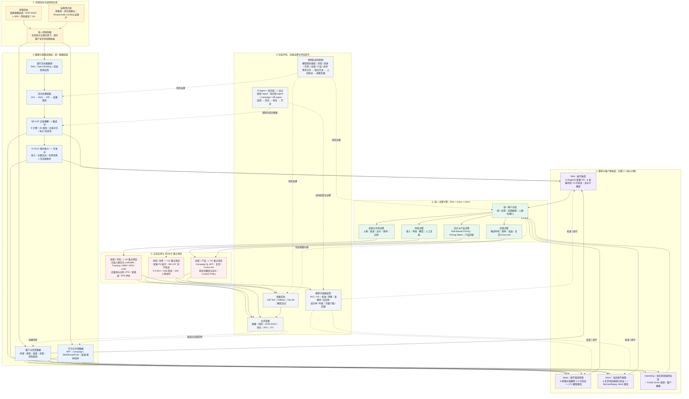

# 澳洲模型体系建设 MBR 汇报 · 模型规划

## 开场｜汇报主线

**核心观点**：澳洲业务模型建设正从「单一风险判断」升级为「风险 × 价值 × 意愿」的组合决策；当前重点是把已验证的单点模型接入统一数据链路和业务流程，形成可调用、可评估、可迭代的经营闭环。

**主线四段**：

1. **为什么现在**：获客贵、转化长、监管严——澳洲经营的三个结构性约束，决定了决策必须从经验走向量化分层；
2. **判断什么**：从「能不能借」（风险）扩展到「值不值得经营」（价值）和「当前想不想借」（意愿），逐步形成联合分层，指导人群、定价、额度与投放；
3. **靠什么支撑**：自研银行流水体系（BS-CAT）——逐步降低对 illion 分类结果的依赖，提升分类粒度、问题定位能力与迭代效率；
4. **走向哪里**：数据 → 能力 → 模型 → 决策 → 业务应用的完整闭环，投放、运营、风控、定价共用一套分层标准。

**读图方式**：自上而下是“目标 → 数据 → 模型 → 决策 → 应用 → 评估”的主链路；虚线是“业务结果、实验、监控和知识”向前回流的迭代闭环。状态标记统一为：● 已上线 / 已完成验证，◐ 建设或集成中，○ 规划。

---

## 模型规划

### P1｜为什么要建设澳洲模型体系

**核心观点**：获客成本高、转化链路长、合规要求严，使“同一人群、同一策略”的粗放经营难以持续；分层决策是同时改善规模、风险与投入产出比的关键抓手。

**关键信息**：

- **获客贵**：现有召回案例中，触达 13.6k 用户仅带来约 30 个 Leads，说明仅靠“圈人—触达”难以回答“谁值得买、花多少钱买”；【建议补充：同期渠道基准、成本及转化口径，避免单一案例被过度外推】
- **转化长**：信贷转化链路长（曝光 → 下载 → 注册 → 申请 → 授信 → 放款），iOS 归因不完整，投放效果长期无法稳定回答「这笔 Loan 是哪次投放带来的」；
- **监管严**：澳洲 Responsible Lending 规则要求信贷机构合理询问客户需求、目标和财务状况，采取合理步骤核实财务状况，并评估合同是否“不适合（unsuitable）”；对 SACC 还需取得并考虑收入账户至少此前 90 天的逐笔交易与余额信息；
- **经营目标**：支撑 2026H2 放款规模目标，以及公司 O2-KR1“NON SAAC 占比全年不低于 40%、风险表现 7.1%”。【待确认：7.1% 对应的风险指标、账龄和观察窗】

**建议展示**：三约束卡片 + OKR 目标条，一页立题。

### P2｜当前处于什么阶段

**核心观点**：澳洲模型建设已完成多项单点能力验证，当前进入“体系化落地”阶段；模型效果已有证据，但统一调用、数据回传和增量评估尚未全部闭环。

**关键信息**：

- **已完成或已验证**：新客价值模型 1.0（OOT AUC 0.729）、老客风险模型 V2（OOT AUC 0.709，较 V1.1 提升 2.84%）、复贷响应模型（AUC 0.703）；WageGo 新客审批风险主模型 2026-06 版本已生产运行；BS-CAT 已完成 preview 部署并开放接口；
- **8 月里程碑**：负债类、收入类知识库初始化完成，Liability 效果报告发布；
- **当前推进中**：消费类知识库建设、新 S-CALC 开发、新 IDA 调用链路开发、两个运维 Agent 开发；
- **9 月目标**：完成 BS-CAT 正式版发布、分类数据落库、IDP/IDA 链路调通和新旧链路并行验证；达到预先约定的质量与稳定性门槛后，再进入切量决策。

**建议展示**：时间线图（8/9 → 8/11 → 8/21 → 8/31 → 9/15 → 切量）。

### P3｜已完成什么：模型版图覆盖客户全生命周期

**核心观点**：已形成覆盖「新客 → 复贷 → 老客」的模型能力版图；核心经营模型已有跨时间或独立样本验证，下一步是统一分层口径并接入业务流程。

**关键信息**：

| 环节     | 模型                                  | 效果（OOT）                                                             | 状态                                                  |
| -------- | ------------------------------------- | ----------------------------------------------------------------------- | ----------------------------------------------------- |
| 新客审批 | WageGo 新客风险主模型                 | 生产运行（2026-06-26 版本）                                             | 已上线，H2 持续迭代区分度                             |
| 新客经营 | 新客价值模型 1.0（LightGBM，17 特征） | AUC 0.729 / KS 0.347；模型高分 Top10% 的弱价值率 63.00%，低分端为 7.30% | 已完成离线评估；授信 / 定价 / 审批 / 分层为拟落地场景 |
| 复贷经营 | 复贷响应模型（结清后 7 天再申请意愿） | AUC 0.703 / KS 0.298，Top10% 复申率 88% vs 底部 31%                     | 已验证，风险中性（不影响信用风险）                    |
| 老客审批 | 老客风险模型 V2（双塔融合）           | AUC 0.709 / KS 0.311，较 V1.1 提升 2.84%                                | 待监管确认后替换 V1.1【待确认】                       |
| 底层数据 | 银行流水分类模型 BS-CAT（9 引擎）     | 35 个 case 的 OOT 中，对 illion 已识别覆盖 98.5%，净增识别 317 条       | preview 已部署；8/31 正式版为计划节点                 |

**建议展示**：客户生命周期横轴（新客 → 复贷 → 老客）+ 模型卡片矩阵，每个模型带一个关键数字。

### P4｜模型之间是什么关系：三维分层一体化体系

**核心观点**：目标态是以风险、价值、意愿三类评分形成统一分层，分别回答“能不能借、值不值得经营、当前想不想借”，共同支撑投放、运营、定价与额度决策。

**关键信息**：

- **三层结构**：数据层（银行流水 + 平台行为 + 征信/替代数据）→ 模型层（风险 / 价值 / 意愿三类模型）→ 决策层（人群分层、额度、定价、审批、投放出价）；
- **统一分层标准（建设中）**：低风险 × 高意愿 × 高价值 = 核心经营人群；高风险 × 高意愿 = 风险控制人群；低风险 × 低意愿 × 高价值 = 激活人群；中风险 × 高意愿 × 高价值 = 定价与产品匹配人群；
- **定价联动**：Risk Band × Value Band × Intent Band → 定价建议矩阵（Pricing Matrix，数据驱动的价格敏感性分析）；
- **老客三级标尺**：Risk Score（风险高不高）→ LTV（长期价值高不高）→ Fundo Score（当前是否值得运营），逐级补充排序能力。

**建议展示**：三层金字塔图 + 三维分层示例表。

### P5｜当前正在推进什么：2026H2 重点项目

**核心观点**：H2 聚焦“银行流水切量准备、三维分层落地、AI 运维试点”三条主线；优先解决找谁、出价多少、客户质量如何、效果如何回传四个问题。

**关键信息**：

- **投放侧（六大方向）**：Risk × Intent × Value 分层标准与投放人群包（P0）、Tracking 归因与回传策略体系（P0）、LTV 测算与买量线 / 边际 CPS 监控（P0）、新客 PD 模型迭代（P0）、A/B 实验规范与增量测试（P0/P1）、新渠道评估与 APP 转化分析（P1）；
- **运营侧（四大方向）**：客户 LTV 模型与三维分层体系（P0）、Risk-Based Pricing 价格敏感性分析（P0）、多触点归因与触达策略基建（P0）、Campaign / AB Test / Email 监控 Agent（P0）；
- **银行流水侧**：推进正式版发布、分类数据落库、新旧 IDP 链路并行验证、S-CALC 与 LMS 改造（计划节点 8/31—9/15）；
- **AI 运维侧**：质检 Agent + 知识库 Agent 试点（OKR O4-KR1），对比 AI 与人工在覆盖率、问题发现时效和人力投入上的差异；
- **跨团队机制**：以模型团队为核心枢纽，与投放、运营团队建立「需求对齐—联合开发—上线验证—效果复盘」闭环（OKR O5-KR2）。

**建议展示**：项目优先级矩阵（P0/P1 × 方向），或三条主线并行的里程碑图。

### P6｜对业务、风险和运营分别带来什么价值

**核心观点**：模型体系把「经验决策」变为「量化决策」，直接支撑投放效率、风险表现与老客经营三大经营目标。

**关键信息**：

- **对风险**：老客风险模型 V2 在同等通过率下坏账更少、或同等坏账下通过更多（swap-in/out 验证方向正确）；风险 × 价值矩阵中「风险1-2 × 价值1-2」客群逾期率仅 6.30%，是值得放量的优质盘；支撑风险表现 7.1% 目标；
- **对投放**：从「买量」升级为「买优质人群」——分层人群包直接供媒体定向调用、回传策略引导媒体算法找「风险可接受、价值可覆盖成本」的人、净 LTV 与边际 CPS 让预算与扩量决策有量化依据；支撑 NON SAAC 占比 ≥ 40%；
- **对运营**：LTV 评价体系统一衡量额度、期限、定价、权益投入；复贷响应模型在结清时点精准识别「立即回来」的客户（Top10% 复申率 88%）；Fundo Score 支撑 Campaign 排序与高潜识别；
- **对组织效率**：计划以“1 人 + 2 个 AI Agent”试点银行流水运维闭环，用 AI 辅助监控、诊断和知识更新；实际节省工时与问题发现时效需在试点后量化。

**建议展示**：三列价值对照表（风险 / 投放 / 运营 × 模型支撑 × 量化指标）。

### P7｜后续规划：从「有模型」到「模型驱动经营」

**核心观点**：H2 完成体系落地后，下一步用实验体系量化模型增量价值，并向 LTV、额度 uplift、RTA 前置风控等方向延伸，最终形成「数据 → 模型 → 决策 → 评估 → 迭代」的经营闭环。

**关键信息**：

- **2026H2 OKR 主线**（O2 业务价值实现，权重 30%）：新客质量分层与投放优化（O2-KR1）、老客意愿能力建设与 Web→APP 增量转化（O2-KR2）、银行流水在核心决策场景落地（O2-KR3）；
- **2026H2 基建主线**（O3，权重 20%）：银行流水分类模型稳定生产运行 + 知识库质量迭代闭环（每月至少 1 次效果监控复盘）；
- **实验体系**：增量额度试点（3–6 个月回答「额度与价值」因果）、投放 Geo-lift / Holdout 增量测试、AB 实验显著性规范；
- **远期方向**：额度 uplift 模型、RTA 实时前置风控评估、Open Banking 等多数据源接入、跨市场能力复用（APP List / 短信 / 变量挖掘平台的经验向澳洲复制）。

**管理层决策点**：确认三项优先级——BS-CAT 切量门槛、价值模型首批场景、增量额度试点风险预算；其余能力建设按上述三项的落地效果排序。

**建议展示**：OKR 目标 → 关键动作 → 里程碑 对照表 + 远期路线图。

---

